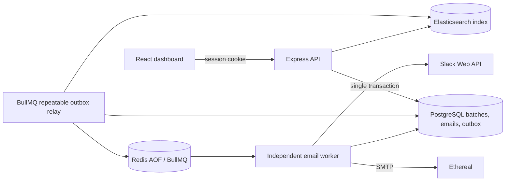

# ReachInbox

Durable email scheduling API, independent BullMQ worker and React dashboard. The desktop screens follow the supplied references: centered Google login, narrow inbox sidebar and search toolbar, sparse message rows, message reading view, and full-page composer with CSV recipient upload and pacing controls.

## Quick start

1. Copy `.env.example` to `.env`. Set a unique `SESSION_SECRET` (at least 32 characters), Google OAuth client ID/secret/callback URL, and a unique 64-character hexadecimal `ENCRYPTION_KEY` (generate one in PowerShell with `[Convert]::ToHexString([Security.Cryptography.RandomNumberGenerator]::GetBytes(32))`). To deliver through a real mail provider, fill **all** `SMTP_HOST`, `SMTP_PORT`, `SMTP_USER`, `SMTP_PASSWORD`, and `SMTP_FROM` settings. Leave all five blank to use Ethereal preview accounts. Configure Slack OAuth values if notifications are wanted. Add `incoming-webhook` to the Slack app and register `SLACK_CALLBACK_URL` as a redirect URL; Slack asks the user to choose a channel.
2. Run `docker compose up --build`. Postgres, Redis AOF, Elasticsearch, API, worker and Vite frontend start as separate services. The API generates Prisma Client and applies the checked-in Prisma migration on startup.
3. Open `http://localhost:5173` and sign in using Google. In **Compose**, choose **Create test sender** if the sender notice appears. This creates an Ethereal account for your user and stores its SMTP password encrypted. Alternatively seed the shared pool with `npm run seed:senders --workspace backend` (or run the seed command in the backend container), then compose a message.

Set `SLACK_CLIENT_ID`, `SLACK_CLIENT_SECRET`, and `SLACK_CALLBACK_URL` to the redirect URL registered with Slack (`/api/slack/callback`). Google callback defaults to `http://localhost:4000/api/auth/google/callback`. Ethereal account passwords are stored encrypted in Postgres; use a protected database volume and restrict access to it.

**Delivery mode:** When no `SMTP_*` credentials are configured, choose **Set up sender** in Compose to create a disposable Ethereal account. Ethereal accepts and stores each message so you can inspect its content using the **Open email preview** link; it does **not** deliver to the recipient's real inbox. For real delivery, set all five `SMTP_*` values and restart the stack, then choose **Set up sender** in Compose; the service verifies the SMTP connection before enabling it. Sender passwords are encrypted at rest. Do not use a provider's test credentials for real recipients.

Keep the encryption key stable once encrypted credentials exist. If you rotate it, decrypt and re-encrypt existing sender and Slack credentials before restarting the service; otherwise those stored credentials cannot be opened.

## Services and scheduling flow



`POST /api/schedule` validates recipients and the message, selects an active sender, and writes the batch, email rows, and enqueue/index outbox rows in one Postgres transaction. Redis and Elasticsearch are touched only after commit. The BullMQ repeatable relay reads pending outbox entries in bounded chunks, uses deterministic email IDs as BullMQ job IDs, and adds jobs in bulk. The worker claims each scheduled row with a conditional update before sending. Search indexing failures leave their outbox row pending for a later relay pass; they do not block SMTP sends.

The BullMQ global limiter is `{ max: 1, duration: MIN_DELAY_BETWEEN_SENDS_MS }`; `MIN_DELAY_BETWEEN_SENDS_MS` defaults to **2000 ms**. A sender-specific Redis NX/PX gate applies the same delay to each sender. Worker concurrency defaults to **10**. Both values are environment-configured and Zod validated.

Hourly quotas are UTC-hour Redis counters executed with Lua. Each email tries the current hour, then the next window with capacity, up to 48 windows. Overflow jobs retain their order using the reserved position in that window and receive the exact future `scheduledAt` in Postgres and Redis. Redis AOF is enabled and mounted on a named volume. The API and worker are separate processes; the worker reconciles scheduled DB rows against waiting/delayed Redis jobs on boot. A BullMQ job scheduler runs the stuck-email sweeper and another repeatable job runs the outbox relay; there is **no cron library, OS cron, or send-driving setInterval**.

Application idempotency is enforced by the per-user unique batch idempotency key, unique `(batchId, recipient)`, a conditional scheduled-to-sending DB claim, and deterministic BullMQ job IDs. SMTP and Postgres cannot participate in one atomic transaction, so exact-once delivery at a remote mailbox cannot be guaranteed. To reduce duplicate risk, the worker persists `smtpStartedAt` immediately before SMTP. A stale claim with no SMTP start is safely requeued; a stale claim after SMTP may have begun becomes `delivery_unknown` and is **not automatically resent**. The same fail-safe applies to ambiguous network errors and to a provider acceptance followed by a DB-finalization failure. This avoids an automatic duplicate at the cost of requiring review and an explicit replacement decision; a message may have been accepted or may not have left the provider. Deterministic `Message-ID` remains a secondary deduplication aid where providers honor it, not a guarantee.

Rate limit delays use a 2-hour TTL on each hourly counter; the send-gap lock uses the configured gap; Slack notices are debounced for one hour per sender/window. Sender circuits open for 15 minutes after `MAX_CONSECUTIVE_FAILURES`. Batch pause/cancel is persisted; resume re-enqueues scheduled emails.

## Checks and scripts

```sh
npm install
npm run typecheck
npm run lint
npm test
```

CI starts a disposable Redis service and sets `TEST_REDIS_URL`, so the parallel Lua concurrency tests run on every push and pull request. For local runs, start Redis and set `TEST_REDIS_URL=redis://localhost:6379` before `npm test`.

Run `npx tsx scripts/restart-test.ts 10` with the compose stack running and an Ethereal sender configured to restart API and worker during a live batch. It checks persisted rows, unique recipients and Message-IDs, and send-time tolerance. It never sends restart-test mail through a real provider. The check cannot prove whether a remote SMTP server accepted a message immediately before a process crash. Run `npx tsx scripts/load-test.ts 1000 200` with Postgres, Redis, Elasticsearch, and the API stack available to create a real 1000-email DB batch, relay its transactional outbox rows into delayed BullMQ jobs, verify all unique jobs, and independently exercise atomic Lua quotas across five ordered hour windows. The jobs are scheduled seven days ahead and cleaned up before delivery. Add `--notify-slack` only when you want a live test message in a connected Slack channel; the script verifies one send and one debounce suppression. The scripts print a summary and clean up test rows/jobs.

## Decisions and trade-offs

- npm workspaces keep API, worker and UI together while allowing each process to scale independently.
- Queue job IDs and database conditional claims make enqueue and competing workers idempotent. Outbox rows are at-least-once and external indexing is idempotent by document ID.
- Redis Lua chooses the earliest hourly window with remaining capacity. This preserves the order in which jobs reserve slots; simultaneous workers may race for that order, but cannot exceed a window quota.
- Per-hour limits are strict UTC calendar-hour windows, not rolling 60-minute windows.
- Elasticsearch is a rebuildable search projection; Postgres remains the source of truth.
- Local Docker OAuth callbacks are provided as development defaults. Production deployments must set HTTPS origins, secure cookies, secrets and OAuth callback URLs explicitly.

## Maintainer and repository

Project maintainer: Harshad Jagadishkumar — https://github.com/Harshad-j

The login screen matches the supplied centered-card reference. Google OAuth is the configured authentication flow. The email/password inputs are included to match the reference and explicitly report that password authentication is not enabled; those values are never sent to the API.

## Detailed local configuration

The root .env file is read by the API and worker. Docker Compose overrides service hostnames inside containers, so use the localhost URLs only when running services directly on the host. Required values include DATABASE_URL, REDIS_URL, ELASTICSEARCH_URL, SESSION_SECRET, and GOOGLE_CALLBACK_URL. Google client credentials can be blank for infrastructure-only development, but login will not complete until valid Google OAuth credentials are configured.

Generate a strong session secret and encryption key locally; do not reuse these examples between environments. The encryption key must be exactly 64 hexadecimal characters (32 bytes). SMTP configuration is all-or-nothing: configure SMTP_HOST, SMTP_PORT, SMTP_USER, SMTP_PASSWORD, and SMTP_FROM together, or leave all blank to use Ethereal provisioning.

For a local run without Docker, start Postgres, Redis, and Elasticsearch separately, then from the repository root run npm install, generate Prisma Client, apply migrations, and start the API, worker, and frontend in separate terminals. The npm workspace scripts are defined in backend/package.json and frontend/package.json. For most contributors, Docker Compose is the simpler supported path because it supplies the matching service hostnames and dependencies.

## API behavior and access

- Google OAuth routes and health/readiness probes are unauthenticated. The dashboard and all email, sender, batch, search, Slack, metrics, and queue-dashboard operations use the signed-in session.
- Schedule requests accept recipients, subject, body, startTime, delayBetweenMs, and optional hourlyLimit. Supply an Idempotency-Key header to safely replay a schedule request.
- Email list endpoints accept page and pageSize. The scheduled view includes scheduled and sending records; the sent view includes sent, failed, and delivery_unknown records.
- Search supports query, status, page, and pageSize and is scoped to the current user's batches.
- Batch pause prevents queued sends while paused; resume republishes remaining scheduled jobs; cancel marks remaining scheduled messages cancelled.
- Sender setup verifies SMTP credentials before saving a sender. Ethereal preview mode stores a preview URL rather than delivering to a real inbox.
- /ready checks PostgreSQL, Redis, and Elasticsearch. /health is a process liveness endpoint. /metrics and /admin/queues require authentication.

## Persistence and recovery

Postgres persists batches, email state, sender credentials, Slack connections, and transactional outbox work. Redis AOF persists BullMQ delayed jobs, sessions, and shared quota state. Elasticsearch stores searchable copies and can be rebuilt from Postgres with scripts/reindex.ts.

The enqueue outbox means a database commit can succeed even while Redis is unavailable; the repeatable relay publishes pending work when dependencies recover. Deterministic job IDs make repeated publication idempotent. Worker startup reconciliation restores scheduled database rows that have no queue job. The sweeper distinguishes safe stale claims from uncertain SMTP attempts; uncertain delivery is surfaced for review rather than automatically resent.

Back up Postgres and preserve the named Compose volumes before upgrades. Redis AOF is durable queue state but is not a replacement for database backups. Elasticsearch can be recreated from the relational source of truth.

## Testing notes

Run the repository scripts from the project root after installing dependencies. Unit tests cover recipient parsing, error classification, sender selection, and the Redis Lua limiter. Set TEST_REDIS_URL to a disposable Redis instance for the parallel rate-limit test. Integration scenarios require real Postgres and Redis; use a disposable Compose environment and never point test scripts at data you need to retain.

The restart and load scripts are operational proofs with limits: restart checks application persistence and timing, but cannot observe SMTP acceptance during a process crash; load checks job uniqueness and quota-window placement, and can optionally verify Slack debouncing. Neither script can prove remote mailbox exactly-once delivery.

## Troubleshooting details

- If the frontend loads but API calls fail, check docker compose ps and docker compose logs -f api worker. Confirm the frontend is using the Compose API proxy and the API is healthy.
- If the API exits during startup, inspect Zod's invalid environment output, then verify database, Redis, Elasticsearch health, and the Google callback URL.
- If sender setup returns an SMTP error, check the exact host and port, TLS expectations, credentials, and authorized From address. Restart the API after editing .env.
- If Redis reports a malformed append-only file, first stop API and worker, preserve a copy of the redis_data volume, then repair the AOF using Redis's own checker. Do not remove the volume as a first step.
- If browser sign-in fails, the OAuth client must allow the exact callback URI used by the API. Google OAuth credentials are separate from SMTP credentials.
- If Slack OAuth returns not configured, set the Slack app ID, secret, and callback URL in .env and recreate the API service.

## License and contribution

No license file is currently included. Add a license before redistributing the project. Before submitting changes, run lint, typecheck, and tests; for queue or delivery changes, also run the relevant disposable Redis/Postgres integration and operational scripts.
