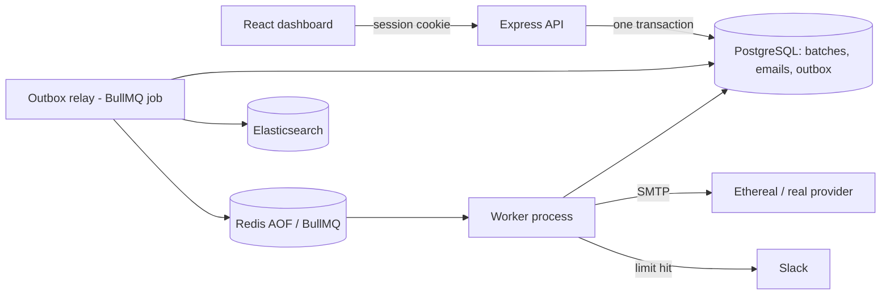

# ReachInbox

**A durable email scheduler that survives restarts, respects rate limits under load, and never double-sends.**

Schedule thousands of emails through an API or dashboard. Jobs are persisted in Redis (BullMQ delayed jobs, no cron), tracked in PostgreSQL, sent from multiple senders over SMTP, searchable in Elasticsearch, and monitored live through Bull Board. When a sender hits its hourly limit, nothing is dropped: the overflow moves to the next available hour window and a Slack alert goes out.

**Stack:** TypeScript · Express · BullMQ + Redis (AOF) · PostgreSQL + Prisma · Elasticsearch · Nodemailer (Ethereal or real SMTP) · React + Vite + Tailwind

---

## Highlights

| Requirement | How it is met |
| --- | --- |
| No cron | BullMQ delayed jobs; the housekeeping loops (outbox relay, stuck-email sweeper) are BullMQ job schedulers |
| Survives restarts | Redis AOF on a named volume, Postgres as source of truth, reconcile-on-boot re-enqueues any missing job |
| No duplicate sends | Four layers: unique batch idempotency key, unique `(batch, recipient)`, deterministic job IDs, atomic `scheduled → sending` claim |
| Concurrency and pacing | `WORKER_CONCURRENCY` (default 10), global 2 s minimum gap plus a per-sender Redis gate |
| Hourly limits across instances | Atomic Redis Lua counters per sender per UTC hour, overflow rescheduled in order, never dropped |
| 1000+ emails at once | Bulk enqueue in chunks, quota windows fill in order (1000 at a limit of 200 spreads across 5 hours) |
| Slack alerts | Real OAuth flow, tokens encrypted at rest, one debounced message per sender per window, silent skip if not connected |
| Search and visibility | Elasticsearch index rebuildable from Postgres, live Bull Board at `/admin/queues`, `/health`, `/ready`, `/metrics` |

---

## Architecture



The API and worker are separate processes that scale independently and shut down gracefully (in-flight jobs finish before exit).

### Scheduling flow (transactional outbox)

1. `POST /api/schedule` writes the batch, one row per recipient, and outbox entries in a **single Postgres transaction**, then returns immediately. Redis and Elasticsearch are never touched inside the transaction.
2. The relay publishes pending outbox entries as delayed BullMQ jobs (`jobId = email id`, added in bulk) and indexes them in Elasticsearch. If Redis or Elasticsearch is down, scheduling still succeeds and the relay catches up when they recover.
3. The worker atomically claims each email, checks the rate limit, sends, and records the result.

### Rate limiting

Each send tries the current UTC hour window for its sender. A Lua script increments the counter and, if the window is full, probes forward (up to 48 hours) until it finds capacity, all atomically. The job is then moved to that window with its order preserved, and its `scheduledAt` is updated so the UI shows the real time. Because the counters live in Redis, the limit holds across any number of workers.

Defaults: **2000 ms** minimum delay between sends, **10** concurrent jobs. Both are set through environment variables.

### Delivery guarantees

Exactly-once delivery to a remote mailbox is impossible when SMTP and the database cannot share a transaction, so the system is explicit about the trade-off: it **never resends automatically when the outcome is uncertain**.

- The worker records `smtpStartedAt` immediately before sending.
- A stale claim with no SMTP start is safely requeued.
- A stale claim after SMTP may have begun becomes `delivery_unknown` and is surfaced for review instead of being resent.
- A deterministic `Message-ID` helps providers deduplicate as a secondary safeguard.

Failures are classified: transient errors retry with exponential backoff, permanent errors fail immediately with the reason stored. A sender that keeps failing has its circuit opened for 15 minutes, and its work is shifted to healthy senders.

---

## Quick start

**Requirements:** Docker Desktop, Node 20+

1. If you don't have a `.env` yet, copy `.env.example` to `.env` (every setting is documented inside the file).
2. Run `docker compose up --build`. Postgres, Redis, Elasticsearch, API, worker, and frontend start together, and migrations run automatically.
3. Open `http://localhost:5173`, sign in with Google, and in **Compose** choose **Create test sender**.

| Service | URL |
| --- | --- |
| Dashboard | http://localhost:5173 |
| API | http://localhost:4000 |
| Bull Board (login required) | http://localhost:4000/admin/queues |

**Ethereal vs real SMTP:** Ethereal stores each message for inspection through a preview link, but does not deliver to real inboxes. Set all five `SMTP_*` values for real delivery; the connection is verified before a sender is enabled. Keep `ENCRYPTION_KEY` stable once credentials are stored.

---

## Using the app

- **Compose:** subject, body, CSV or text upload of leads (with the detected count), start time, delay between emails, and hourly limit. Repeated requests with the same `Idempotency-Key` are safe.
- **Scheduled / Sent tabs:** paginated tables with loading and empty states. Sent includes `sent`, `failed`, and `delivery_unknown`, with the Ethereal preview link.
- **Batches:** pause, resume, or cancel.
- **Search:** `GET /api/emails/search?q=&status=&page=&pageSize=`, scoped to the signed-in user.

---

## Tests and proof

```sh
npm install
npm run typecheck && npm run lint && npm test
```

CI runs these against a disposable Redis (`TEST_REDIS_URL`), including parallel tests of the Lua limiter. Set `TEST_REDIS_URL` to a throwaway Redis to run them locally.

| Script | What it proves |
| --- | --- |
| `npx tsx scripts/restart-test.ts 10` | Kills and restarts the API and worker during a live batch, then checks persisted rows, unique recipients and Message-IDs, and send-time tolerance |
| `npx tsx scripts/load-test.ts 1000 200` | Creates a real 1000-email batch, relays it into delayed jobs, verifies every job is unique, and confirms the quotas fill five ordered hourly windows. Add `--notify-slack` for a live alert with debounce check. |

Neither script can observe whether a remote SMTP server accepted a message at the exact moment of a crash. That limit is why `delivery_unknown` exists.

---

## Design decisions

- **Outbox over dual writes:** Postgres, Redis, and Elasticsearch can never disagree permanently, and an outage in one does not break scheduling.
- **Lua over the BullMQ limiter for hourly quotas:** the built-in limiter is per queue, while sender-scoped hourly windows with rescheduling need atomic, per-sender counters.
- **Fixed UTC hour windows** rather than rolling windows: simple, predictable, and cheap to enforce atomically.
- **Postgres is the source of truth.** Elasticsearch can be rebuilt any time with `scripts/reindex.ts`, and Redis AOF is durable queue state, not a database backup.
- **Fail safe over fail duplicate:** an uncertain send is flagged, never silently repeated.

---

## Troubleshooting

- **Frontend loads but API calls fail:** run `docker compose logs -f api worker` and check that `/ready` reports Postgres, Redis, and Elasticsearch as healthy.
- **API exits on startup:** read the Zod environment error, then check the Google callback URL and service health.
- **Google sign-in fails:** the callback URI in `.env` must exactly match the one in Google Cloud.
- **Slack says "not configured":** set the Slack variables in `.env` and run `docker compose up -d --force-recreate api`.

---

**Author:** Harshad Jagadishkumar · [github.com/Harshad-j](https://github.com/Harshad-j)