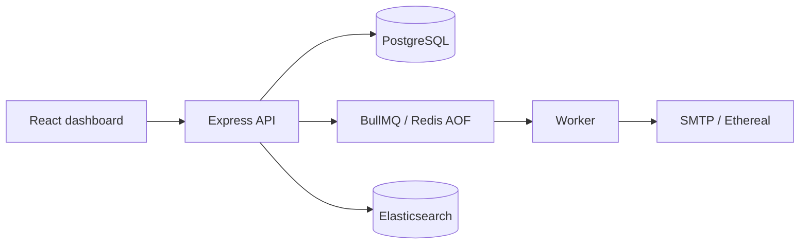

# Architecture

Email claims are conditional Postgres updates. Before SMTP, the worker records `smtpStartedAt`; safe pre-SMTP interruptions are requeued. An interruption after SMTP may have begun becomes `delivery_unknown` and is surfaced in the Sent view without automatic retry, because a remote SMTP acceptance cannot be atomically committed with the Postgres status update.
